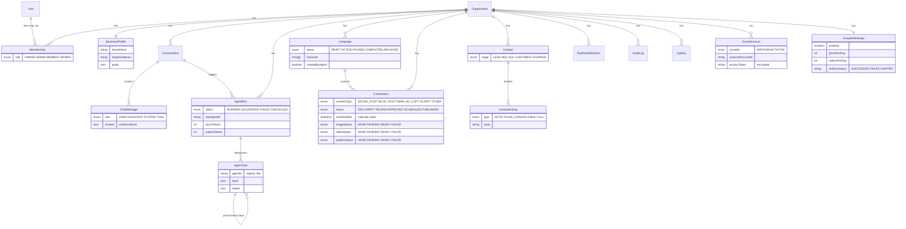

# Raalhu AI — Data Model

All Raalhu tables are prefixed `raalhu_` (Prisma `@@map`) and live in
`prisma/schema/raalhu.prisma`, alongside the shared NextAuth models
(`base.prisma`). `Organization` is the tenancy boundary — every domain row
hangs off it and every query filters by `organizationId`.

Notes:

- `createdById` / `triggeredById` / `actorUserId` are plain indexed user-id
  strings, not relations, to minimize churn on the shared `User` model. The
  only Raalhu relation on `User` is `memberships`.
- `ContentItem.@@index([organizationId, scheduledAt])` powers the calendar;
  `Contact.@@unique([organizationId, email])` dedupes CRM contacts per org.
- `ContentItem` image/video fields (`image*`/`video*`, `mediaError`) track
  AI-generated visuals (Higgsfield, `src/lib/higgsfield.ts`). Generation is
  async — jobs start `PENDING` and are moved to `READY`/`FAILED` either by a
  short bounded poll at request time or by the client polling
  `GET /api/raalhu/content/[id]/media-status`. Video is image-to-video only,
  so it requires an existing image on the same item.
- `SocialAccount` is one connected account per provider per org
  (`@@unique([organizationId, provider])`) — `src/lib/meta.ts` (Instagram
  Graph API) and `src/lib/tiktok.ts` (Content Posting API) handle OAuth and
  publishing; `src/modules/raalhu/lib/social.ts` dispatches by matching a
  `ContentItem.channel` string (contains "instagram"/"tiktok") to a connected
  provider. Instagram publishes an existing image or video; TikTok publishes
  video only. Tokens are AES-256-GCM encrypted (`src/lib/crypto.ts`) and never
  selected into API responses. `ContentItem.publishStatus`/`publishJobId`
  track TikTok's async publish job the same way image/video generation is
  tracked — polled via the same media-status endpoint.
- `ContactActivity.@@index([contactId, createdAt])` powers the CRM timeline;
  stage changes on a `Contact` are auto-logged as a `STAGE_CHANGE` activity.
- `AutopilotSettings` (`src/modules/raalhu/lib/autopilot.ts`) is opt-in
  daily automation, disabled by default. Vercel Cron hits
  `GET /api/cron/autopilot` once a day (`vercel.json`, secured by
  `CRON_SECRET` — deliberately outside `/api/raalhu/*`, since that prefix's
  proxy guard requires a browser session a cron job doesn't have). It runs
  the normal master-agent orchestration (`startRun`) as the org's OWNER
  member, with an instruction to draft the configured post/video count and
  save everything as `DRAFT` — it never calls the publish tools itself.
- Migrations live in `prisma/schema/migrations/` (`init_baseline` = base
  schema, `raalhu_multitenant` = core Raalhu models, `remove_skillpips` =
  dropped the pre-existing SkillPips tables/columns, `raalhu_crm_depth` =
  `ContactActivity`).
