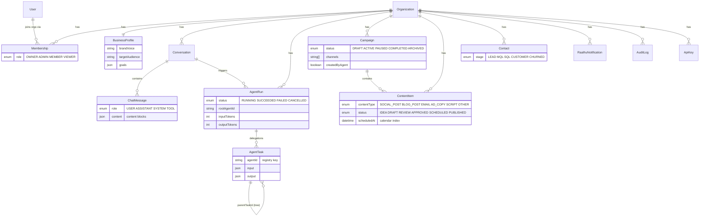

# Raalhu AI — Data Model

All Raalhu tables are prefixed `raalhu_` (Prisma `@@map`) and live in
`prisma/schema/raalhu.prisma`, alongside the shared NextAuth models
(`base.prisma`) and SkillPips models (`skillpips.prisma`). `Organization` is
the tenancy boundary — every domain row hangs off it and every query filters
by `organizationId`.

Notes:

- `createdById` / `triggeredById` / `actorUserId` are plain indexed user-id
  strings, not relations, to minimize churn on the shared `User` model. The
  only Raalhu relation on `User` is `memberships`.
- `ContentItem.@@index([organizationId, scheduledAt])` powers the calendar;
  `Contact.@@unique([organizationId, email])` dedupes CRM contacts per org.
- `RaalhuNotification` is named to avoid colliding with SkillPips'
  `Notification` model.
- Migrations live in `prisma/schema/migrations/` (`init_baseline` = pre-Raalhu
  tables, `raalhu_multitenant` = everything here).
